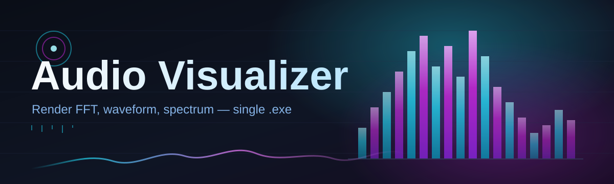
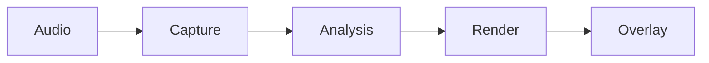

# audio-visualizer-overlay 🎧✨

  

*A desktop overlay that turns raw sound into living light, sitting quietly above every window on your screen.*

  

---

## 🌊 Overview

**audio-visualizer-overlay** is a lightweight, always-on-top rendering layer that listens to your system's audio output and translates it into real-time waveform, spectrum, and particle visuals — without ever touching the windows underneath it. Think of it less as an application and more as a pane of glass laid over your desktop, one that happens to ripple, pulse, and glow in perfect sync with whatever is playing through your speakers.

<strong>📖 The full story — why this project exists</strong>

 

The idea started with a simple frustration: most audio visualizer tools are trapped inside a media player, a browser tab, or a full-screen "now playing" mode that steals focus from everything else. Streamers wanted ambient motion behind their gameplay. Musicians wanted a way to *see* their mix while working in a DAW. Desktop tinkerers wanted their monitor to feel alive during a late-night listening session, without sacrificing their workspace.

audio-visualizer-overlay was built to solve that specific gap — an audio visualizer that behaves like a transparent HUD rather than a standalone media app. It taps into the Windows audio pipeline, reads the waveform in near real time, and paints it directly onto a click-through, borderless overlay window. No playlists to manage, no library to import, no account to create. Point it at your system audio, pick a visual style, and let it run in the background like a second monitor made of sound.

Over time the project grew from a single spectrum-bar prototype into a small but dedicated toolkit: multiple render modes, theme presets, hotkey-driven controls, and a settings panel that remembers exactly how you like your desktop to breathe. It remains, at its core, an audio visualizer first — everything else exists to make that one job feel effortless.

Whether you are a streamer building ambience for a broadcast, a musician who wants a second pair of eyes on their audio signal, or simply someone who enjoys watching sound take shape, this tool is built around one idea: your speakers already know the rhythm — this just gives it somewhere to live.

---

## 🔥 What It Actually Does

- **Reads your system audio directly** — no virtual cables, no routing software, no manual setup. It listens to the default output device and starts rendering within seconds.

- **Floats above everything, clickable through** — the overlay window is transparent to mouse input by default, so it never interrupts your workflow, your game, or your stream capture.

- **Reacts frame-by-frame, not beat-by-beat** — rather than guessing at tempo, the renderer samples the raw waveform and frequency spectrum continuously, producing motion that feels genuinely tied to the sound rather than approximated.

- **Ships with multiple render modes** — waveform ribbons, mirrored spectrum bars, radial pulse rings, and a particle-field mode that scatters and gathers with amplitude.

- **Theme presets built for different moods** — from a minimal monochrome line to a full neon-gradient spectrum, each theme is a complete color and motion profile you can swap instantly.

- **Runs as a standalone executable** — there is nothing to compile, nothing to configure at a system level, and nothing left behind when you close it.

- **Remembers your layout** — position, size, opacity, and active theme persist between sessions automatically.

- **Multi-monitor aware** — the overlay can be pinned to any connected display independently of where your other windows live.

> [!TIP]
> Pair a subtle waveform theme with low opacity on a secondary monitor for an ambient "audio pulse" that never competes with your main workspace.

---

## 🚀 Getting Started

Follow these steps in order — the whole process takes less than two minutes.

1. **Visit the landing page.** Click the download button above or below to open the official project page.

2. **Download the latest build.** The page always points to the current release; there is nothing else to fetch or configure separately.

3. **Run the executable.** No installer wizard, no background service — double-click and the overlay appears on your primary display within a few seconds.

4. **Pick a render mode and theme.** Right-click the overlay (or use the tray icon) to open the settings panel and start customizing immediately.

> [!NOTE]
> The overlay starts in a default "waveform ribbon" mode with a neutral theme so you always have a working visual on first launch, even before touching any settings.

---

## 🖥️ System Requirements

| Component | Minimum | Recommended |
|---|---|---|
| **OS** | Windows 10 (64-bit) | Windows 11 (64-bit) |
| **RAM** | 2 GB available | 4 GB available |
| **Disk** | 150 MB free space | 300 MB free space |

> [!IMPORTANT]
> audio-visualizer-overlay is a standalone Windows application with no external dependencies, no runtime installers, and no background telemetry services. It reads directly from your system's audio output device.

---

## ⚙️ How It Works

The overlay operates as a small, continuous loop rather than a one-shot render:

1. **Audio capture** — the tool taps into the default system audio output stream at a fixed sample rate.
2. **Signal analysis** — incoming samples are processed into both a raw waveform and a frequency spectrum using a fast transform.
3. **Frame mapping** — the analyzed data is mapped onto the currently selected render mode's geometry (bars, ribbons, rings, particles).
4. **Compositing** — the frame is drawn onto a transparent, click-through overlay surface positioned above all other windows.
5. **Loop** — the cycle repeats at a steady frame interval, keeping motion tightly synced to whatever audio is currently playing.

---

## 🛟 Troubleshooting

**Q: The overlay window is transparent but I don't see any motion.**
A: Confirm your default playback device in Windows sound settings matches the device actually producing audio — the visualizer follows the system default, not a specific app.

**Q: My frame rate looks choppy on the particle-field mode.**
A: Particle mode is the most render-intensive style. Try switching to waveform ribbons or lowering the overlay's resolution scale in settings.

**Q: The overlay disappeared after I clicked on it.**
A: Click-through mode is enabled by default, so clicks pass to whatever is beneath it. Use the tray icon to bring the settings panel forward instead.

**Q: It only shows on my primary monitor — can I move it?**
A: Yes. Open settings and select the target display from the monitor list; the overlay will reposition immediately.

**Q: Sound is playing but the spectrum bars stay flat.**
A: This usually means the audio session is being captured from an exclusive-mode application. Switch that application to shared audio mode in Windows sound settings.

> [!WARNING]
> Running multiple instances of the overlay simultaneously can cause both to compete for the same audio stream, resulting in stuttering visuals. Stick to a single running instance per session.

---

## 🎨 UI / UX Details

<strong>Keyboard shortcuts</strong>

 

| Shortcut | Action |
|---|---|
| `Ctrl + Shift + V` | Toggle overlay visibility |
| `Ctrl + Shift + M` | Cycle render mode |
| `Ctrl + Shift + T` | Cycle theme preset |
| `Ctrl + Shift + L` | Lock / unlock click-through |
| `Esc` | Close settings panel |

- **Themes** — Monochrome Line, Neon Spectrum, Pulse Ring, Deep Field, and a customizable palette editor.
- **Opacity control** — a single slider governs overlay transparency, from a faint ambient trace to a fully solid render.
- **Tray-first design** — the app minimizes to the system tray by default, keeping your taskbar uncluttered.
- **Settings persistence** — every layout and theme choice is saved automatically on exit.

> [!TIP]
> If you stream, lock click-through *before* going live so an accidental click never drags the overlay mid-broadcast.

---

## 🤝 Contributing & Community

Contributions of every size are welcome — from new render modes and theme presets to documentation fixes and bug reports.

- Open an issue to report a bug or suggest a new visualizer style.
- Fork the repository and submit a pull request with a clear description of the change.
- Join discussions on rendering techniques, performance tuning, and theme design.

 

> [!NOTE]
> This project is maintained by volunteers in their spare time. Please be patient with review times, and be specific when describing rendering issues — screen recordings help enormously.

---

## 📜 License

Released under the [MIT License](LICENSE), 2026. You are free to use, modify, and distribute this project in accordance with the terms of that license.

---

## ⚠️ Disclaimer

audio-visualizer-overlay is provided "as is," without warranty of any kind. It is a visual accompaniment tool only — it does not record, store, or transmit any audio it processes. Use of this software is at your own discretion, and the maintainers are not responsible for any indirect issues arising from its use on your system.

---

